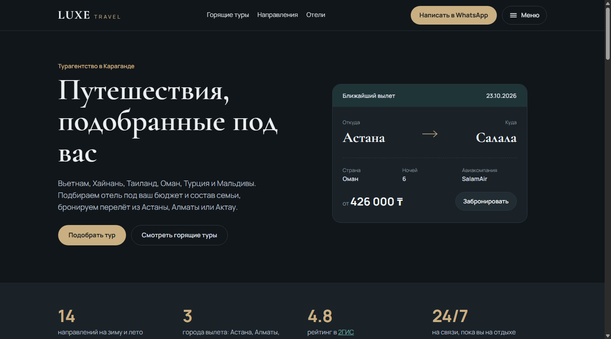
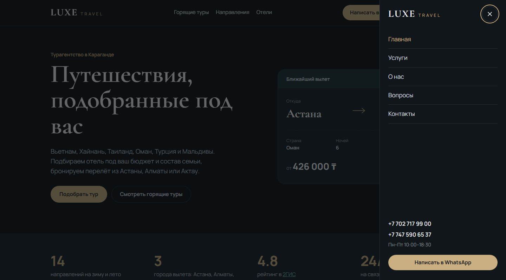

# Luxe Travel

Сайт турагентства Luxe Travel из Караганды. Здесь можно посмотреть горящие туры, выбрать страну и отель и сразу написать менеджеру в WhatsApp. Агентство подбирает туры с вылетом из Астаны, Алматы и Актау.

**Открыть сайт:** https://chpokvpopok.github.io/luxe-travel/

## Страницы

### Главная
Первое, что видит посетитель. Карточка ближайшего вылета с ценой и кнопкой бронирования, затем:
- горящие туры;
- популярные направления;
- почему с агентством спокойно;
- отели из обзоров в Instagram;
- как проходит работа: заявка, подборка, бронирование, документы;
- отзывы туристов.

### Горящие туры
Все актуальные предложения: направление, дата вылета, число ночей, авиакомпания и цена «от — до». Туры можно отфильтровать по городу вылета и по стране. В каждой карточке есть кнопка, которая открывает WhatsApp с готовым сообщением про этот тур.

### Направления
14 стран: Вьетнам, Хайнань, Таиланд, Оман, Турция, Мальдивы, Бали, Малайзия, Гоа, ОАЭ, Египет, Шри-Ланка, Черногория и Грузия. Их можно отфильтровать по сезону (зима или лето). Ниже подсказки, куда поехать с маленькими детьми, в медовый месяц, недорого или на выходные.

### Страница страны
У каждого направления своя страница:
- сезон, время перелёта, визовые правила и валюта;
- главные курорты с описанием;
- почему стоит поехать;
- горящие туры и отели в эту страну;
- похожие направления.

### Отели
Подборка отелей из сторис-обзоров агентства: звёздность, расположение и короткое описание. Можно отфильтровать по стране.

### Услуги
Пакетные и горящие туры, семейный отдых, свадебные путешествия, групповые и корпоративные поездки, помощь со страховкой и визами. Ниже четыре шага от заявки до отпуска.

### О нас
Кто работает в агентстве, его принципы, команда менеджеров и отзывы туристов.

### Вопросы
Ответы на частые вопросы, разбитые на три темы:
- **Бронирование и оплата:** как забронировать, можно ли без визита в офис, способы оплаты.
- **Документы и визы:** нужна ли виза, срок действия паспорта, документы для поездки с ребёнком.
- **Во время поездки:** страховка, что делать при проблемах в отеле, можно ли изменить даты.

### Контакты
Адрес офиса, телефоны, WhatsApp, Instagram и часы работы.

## Заявка в один клик

На большинстве страниц есть блок «Подберём тур под ваш бюджет». В нём указывают направление, город вылета, даты, кто едет и бюджет. После отправки открывается WhatsApp с уже заполненным сообщением, менеджеру остаётся только ответить. Регистрация и ожидание звонка не нужны.

## Удобно с телефона

Сайт подстраивается под любой экран. Чтобы шапка не была перегружена, второстепенные разделы убраны в боковое меню. Внизу экрана всегда есть кнопка WhatsApp.

## Как сделан

- Чистый HTML, CSS и JavaScript, без фреймворков и сборки: сайт быстро загружается.
- Тёмная тема с золотыми акцентами, шрифты Cormorant Garamond и Manrope.
- Размещён бесплатно на GitHub Pages.
